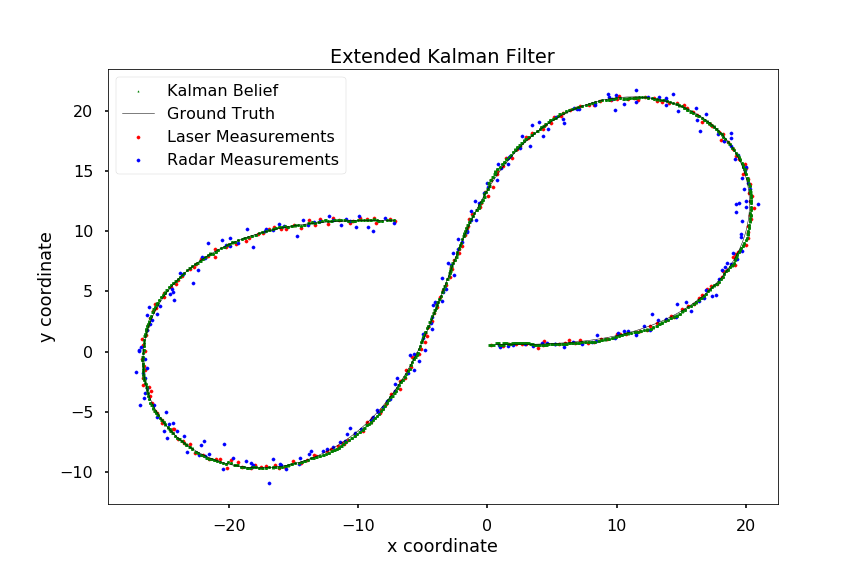
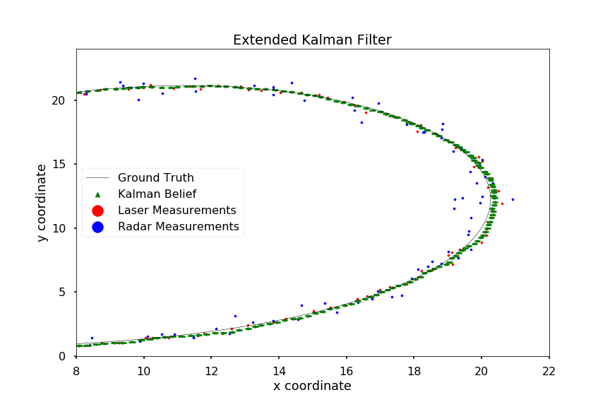
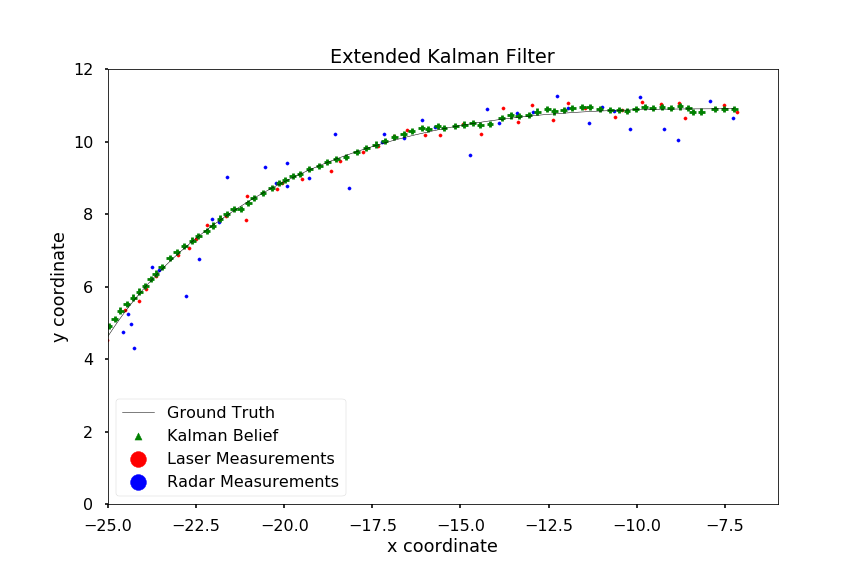
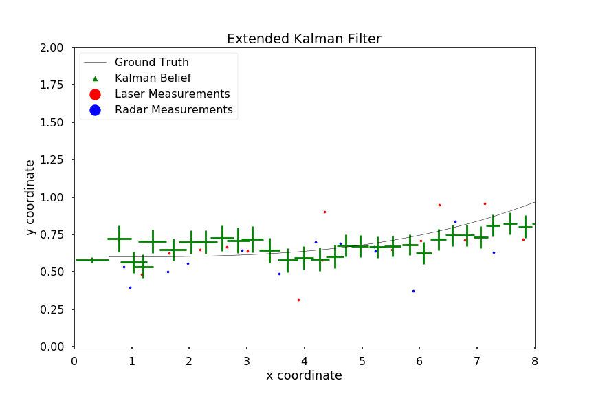

# Extended Kalman Filter

This repository is the solution for [Term 2, Project 1](https://github.com/udacity/CarND-Extended-Kalman-Filter-Project/) of the [Self-Driving Car Engineer Nanodegree](https://www.udacity.com/course/self-driving-car-engineer-nanodegree--nd013) program.

In this project we implement an [Extended Kalman Filter](https://en.wikipedia.org/wiki/Extended_Kalman_filter) (EKF) to make belief estimates of the position and velocity of an object based on noisy [Lidar](https://en.wikipedia.org/wiki/Lidar) and [Radar](https://en.wikipedia.org/wiki/Radar) measurements of that object's position and velocity. The EKF differs from a plain [Kalman Filter](https://en.wikipedia.org/wiki/Kalman_filter) (KF) in that it allows nonlinear (but differentiable) state transition and observation models. It accomplishes this by using a linear estimate of the non-linear functions using a [Taylor series](https://en.wikipedia.org/wiki/Taylor_series). 

In this project, the EKF allows us to incorporate measurements from the non-cartesian coordinate space in which the radar measurements are provided. Using the EKF, we fuse measurements from laser and radar measurements to arrive at a single belief of position and velocity over time. Our state transition model remains linear and does not require a linearization step.

## Project Files

The project respository is organized as follows.

* [`src`](src) directory contains the source files for the project, including:
	* [`main.cpp`](src/main.cpp) runs the application and interfaces with the [Udacity simulator app](https://github.com/udacity/self-driving-car-sim/tags) to plot results.
	* [`FusionEKF.cpp`](src/FusionEKF.cpp) owns a `KalmanFilter` instance. Initializes the parameters of the `KalmanFitler` object and processes measurements by sending them to the appropriate `KalmanFilter` instance methods.
	* [`kalman_filter.cpp`](src/kalman_filter.cpp) defines a `KalmanFilter` class, which maintains the belief vector and covariance through many predict/update steps. It has instance methods `Predict`, `Update`, and `UpdateEKF` which implement plain and extended Kalman filter steps. `Update` accepts a laser measurement of the object's position in the cartesian coordinate system. `UpdateEKF` accepts a radar measurement of the object's position and velocity in a [polar coordinate system](https://en.wikipedia.org/wiki/Polar_coordinate_system).
	* [`tools.cpp`](tools.cpp) contains helper functions, e.g. for calculating root mean square error, the EKF Jacobian, and coordinate system conversions.
* [`build`](build) directory containing build products and executable
* [`Notebook.ipynb`](Notebook.ipynb) containing some analysis and Python code to create figures
* [`results`](results) directory containing figures and results
* [`data`](data) directory containing input and output data

For details on the rest of the project, see [`Assignment.md`](Assignment.md) and the [original project repository](https://github.com/udacity/CarND-Extended-Kalman-Filter-Project/).

## Build and Run

This project has been built and To run the project, perform the following steps:

1. Clone this repository.
2. Make a build directory: `mkdir build && cd build`
3. Compile: `cmake .. && make` 
4. Run the executable: `./ExtendedKF`
5. Launch the [Udacity simulator app](https://github.com/udacity/self-driving-car-sim/tags) (tested on version 1.4)
6. Choose a resolution/quality
7. Click "Select" for "Project 1/2: EKF and UKF"
8. Click "Start"

The output of the EKF will show in the Term 2 simulator and in the console. To obtain the results found in [`data/output.txt`](data/output.txt), the output from Step 4 is piped into an output file from the shell, and minimally cleaned up to be used by `Notebook.ipynb`.

## Results

The table below shows the root mean squared error (RMSE) for our results, along with the project criteria below which our RMSE must be. The uncertainty associated with the Kalman Filter belief decreases over time (with measurements of roughly uniform uncertainty), and so our final RMSE values are lower than the RMSE values when the simulation begins.

All the final RMSE values fall below the project criteria, although for some of the dimensions, a substantial fraction of measurements are higher than the criterion values (especially velocity, which we obtain only from radar measurements).

| Dimension    | Rows Failing RMSE Criterion | Final RMSE | Project RMSE Criterion |
|--------------|-----------------------------|------------|------------------------|
| `x`          | 6.81%                       | 0.097      | 0.11                   |
| `y`          | 0.00%                       | 0.085      | 0.11                   |
| `v_x`        | 67.54%                      | 0.451      | 0.52                   |
| `v_y`        | 32.46%                      | 0.440      | 0.52                   |

The figure below shows the entire field of measurements, including ground truth, Kalman belief, and radar and lidar measurements.

The following three figures show three different zoomed-in regions from the first plot, showing areas of particular interest. Note that the Kalman belief deviates most substantially from the ground truth in regions of highly nonlinear travel. This makes sense, as our state transition model is linear and our motion is not always best described by linear motion.

